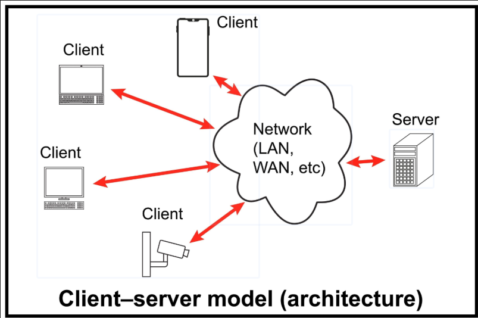

# Clase 1 - Introducción al desarrollo web (Starter)

Este documento sirve como guía para el profesor durante la demostración en vivo de la clase 1.

### ¿Qué es un sitio web?

Cuando entras a tu red social favorita o a una página de noticias, lo que estás viendo en tu pantalla no es más que un archivo de texto con instrucciones que tu navegador (Chrome, Opera, Edge, Safari, etc.) sabe leer y transformar en botones, imágines y colores.

### Modelo Cliente-Servidor (Analogía con restaurante)

¿Cómo llega este texto que visualizas en la página a tu pantalla? Antes que nada, primero imagina que estás en un restaurante. Tú eres el Cliente **(el navegador)**. Miras el menú y le pides al mesero un plato de comida. El mesero lleva la orden a la cocina, que es el **Servidor**. La cocina prepara la comida y el mesero la trae. En la web es igual: tú escribes `google.com` **(realizas una petición)**, el servidor de Google procesa la orden y te devuelve el archivo de texto **(la respuesta)** para que tu navegador lo dibuje.

### Frontend vs. Backend

**- Frontend:** Es la parte del restaurante que puedes ver: las mesas, la decoración, el plato servido. En la web, es todo lo que el usuario ve y toca (diseño, botones, animaciones).

**- Backend:** Es la cocina. No la ves, pero ahí se guarda la receta, los ingredientes y se procesa todo. En la web, es donde se guardan las contraseñas, los datos de los usuarios y la lógica del negocio. 